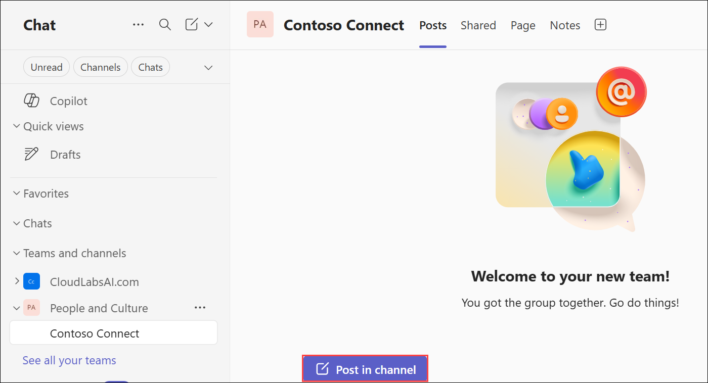
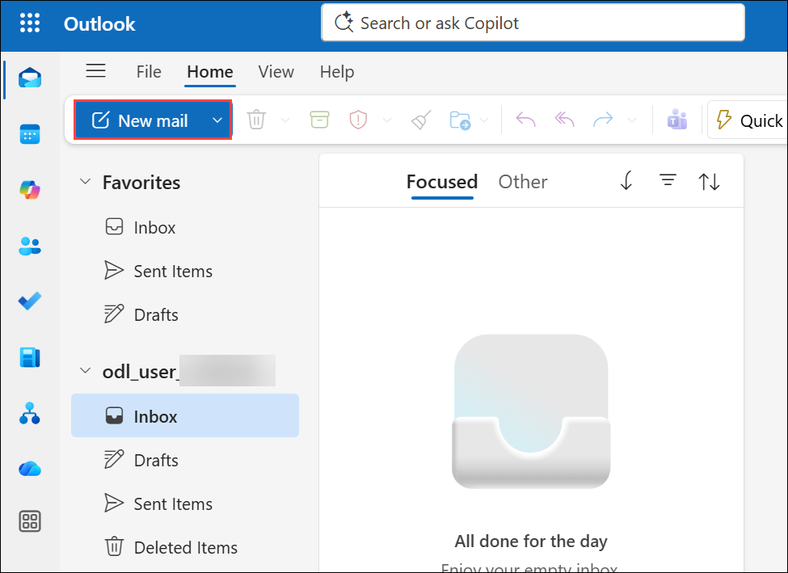

# Lab 03: Manage collaboration from start to finish

### Estimated Duration : 45 Minutes

## Lab Scenario

Imagine you're a manager at Contoso. Your team relies on effective communication to collaborate and achieve goals. You want to rally the team behind a new idea for the Contoso Connect product launch, and need to send a message to your team about how to incorporate this idea before the product launch deadline. Use Copilot to draft, rewrite, and adjust your message to ensure it's clear, concise, and professional.

## Lab Objectives

In this lab, you will complete the following tasks:

- Task 1: Write an engaging message to introduce your idea
- Task 2: Schedule a meeting in Outlook

## Task 1: Write an engaging message to introduce your idea

In this task, you will use Copilot in Teams to draft, rewrite, and adjust a message introducing your idea for the Contoso Connect launch, ensuring it is clear, engaging, and professional for your team.

1. Open **Microsoft Teams** by navigating to the following URL: [teams.microsoft.com](https://teams.microsoft.com).

1. Provide the credentials below to login:

   - **Email/Username:** <inject key="AzureAdUserEmail"></inject>

   - **Password:** <inject key="AzureAdUserPassword"></inject>

1. To start, create a new Team in your team's chat for this conversation. Select the drop down **(1)** and then select **New Team (2)** from the Chat dropdown menu.

    

1. On the **Create a team**,

    - Team name:  Enter **People and Culture (1)**
    - Description: leave blank **(2)**
    - Team Type: **Private (3)**
    - Channel name: Enter **Contoso Connect (4)**
    - Select **Create (5)**

              

1. Select **Skip** on **Add members to People and Culture**.

        

1. Select **Post in channel** to open the chat window.

    

1. Write your message in the box at the bottom of the chat or channel. **Copy and paste** the following text **(1)** into the dialog box: 
    
    ```
    Hi Team! I've been thinking about Contoso Connect, and how we can make the product launch more exciting for our customers. I have a couple of ideas, and want to hear more from each of you. What do you think would make our customers excited and ready to work with Connect?
    ```

    - Before you post the message, select the **Rewrite with Copilot (2)** icon at the bottom of the message box.

      

1. Choose the **Rewrite** option to generate another version of your message that improves its grammar and style. You can rewrite your message up to 10 times, each time generating a new version. Use the left and right arrows below the text to navigate through versions.

    

1. While this message is adequate, it lacks the enthusiasm you're trying to convey.

1. Select **Adjust** then select from the options Copilot presents to edit and update your message. You can customize the message if it's still not right.

    

1. Select **Custom** from the **Adjust** option.

    

1. Try custom tones like `instructive` or `engaging` **(1)** and then **Send (2)**.

    

1. Select **Replace** when you're satisfied with the new message. If you selected a partial section, only that text updates.

    

1. Once you replace the original message, select **Post**.

    

        

The team receives your message and is excited to contribute! Everyone contributes ideas and discusses potential issues in the Teams chat.

> **Congratulations** on completing the task! Now, it's time to validate it. Here are the steps:

- Hit the Validate button for the corresponding task. You will receive a success message. 
- If not, carefully read the error message and retry the step, following the instructions in the lab guide.
- If you need any assistance, please contact us at cloudlabs-support@spektrasystems.com. We are available 24/7 to help you out.

<validation step="ac4f0700-73b9-4576-8dbe-57b852ffc343" />

## Task 2: Schedule a meeting in Outlook

In this task, you will use Copilot in Outlook to find an optimal meeting time and draft a professional invite, ensuring your team can efficiently collaborate on the Contoso Connect launch.

1. Open **Microsoft Outlook** from your browser [outlook.office.com](https://outlook.office.com).

1. Select **New Email**.

    

1. Select the **Copilot** icon from the ribbon to open the Copilot pane.

    

1. Ask Copilot to suggest the best time for the meeting by entering the following prompt **(1)** and then click **Send (2)** :

   ```
   Draft a meeting invitation to discuss the upcoming product launch, review the project timeline, and assign tasks. 
   ```

    

1. Copilot creates a draft of the meeting invite. Review the suggestion then enter the following prompt **(1)** and select **Send (2)**:

    ```
    Rewrite this email in a professional tone.
    ```

    
  
1. Review Copilot's suggestion and select to **Replace**.

      

1. After you've created your draft, you can continue to prompt Copilot assist you in scheduling the meeting based on your availability next week. Copilot suggests several time slots. You can select the time that best works. Copilot adds the meeting to your calendar. You can then access the meeting details from you calendar and invite attendees, turn on the Facilitator for the meeting, and allow Copilot to reschedule the meeting if conflicts arise.

By using Copilot in Team's capabilities, you can effortlessly draft, rewrite, and adjust messages, gather insights from team chats, and schedule meetings efficiently. Now, you can confidently use these tools to streamline your workflow and achieve your collaboration goals with ease.

> **Congratulations** on completing the task! Now, it's time to validate it. Here are the steps:

- Hit the Validate button for the corresponding task. You will receive a success message. 
- If not, carefully read the error message and retry the step, following the instructions in the lab guide.
- If you need any assistance, please contact us at cloudlabs-support@spektrasystems.com. We are available 24/7 to help you out.

<validation step="b2bec1d4-fe29-46fc-9619-8a68bdd17e29" />

## Summary

In this lab, you explored how Microsoft 365 Copilot in Teams and Outlook can help draft, refine, and share professional communications. You created an engaging message for your team, used Copilot to rewrite and adjust it for clarity and tone, and scheduled a meeting using Copilot to find the best time and draft a polished invite. Finally, you experienced how Copilot streamlines collaboration and team communication for effective project management.

### You have successfully completed the lab. Click **Next >>** to proceed.


