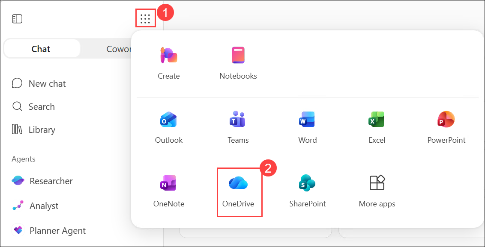
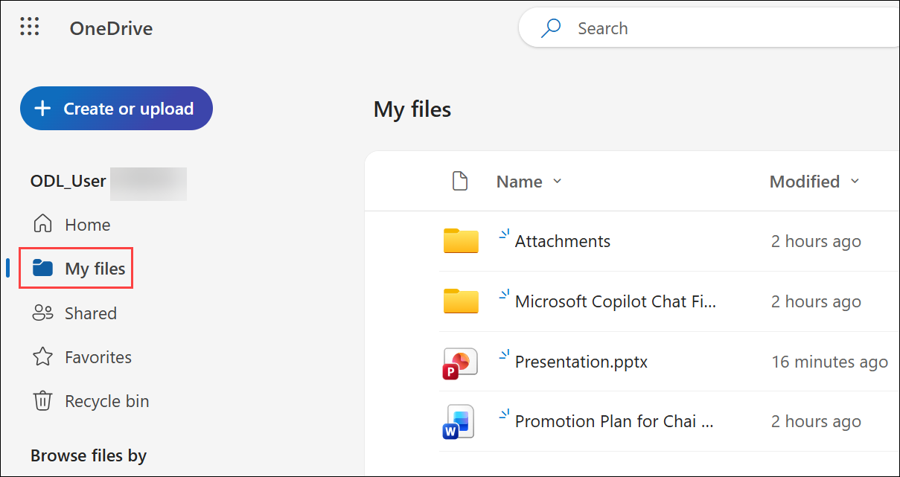
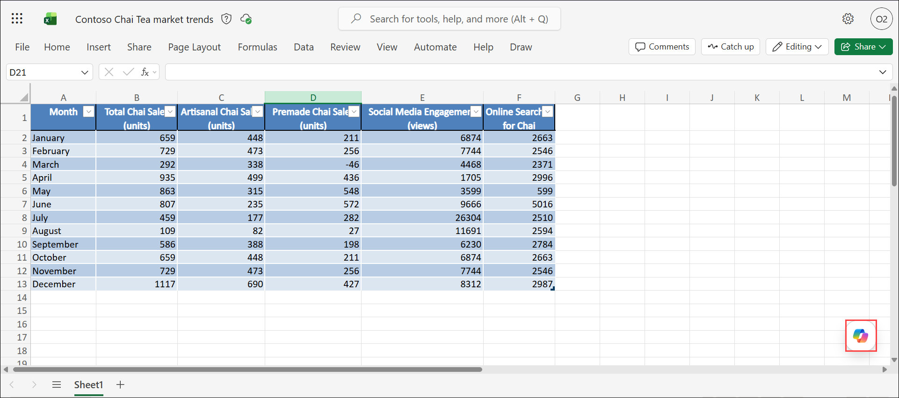
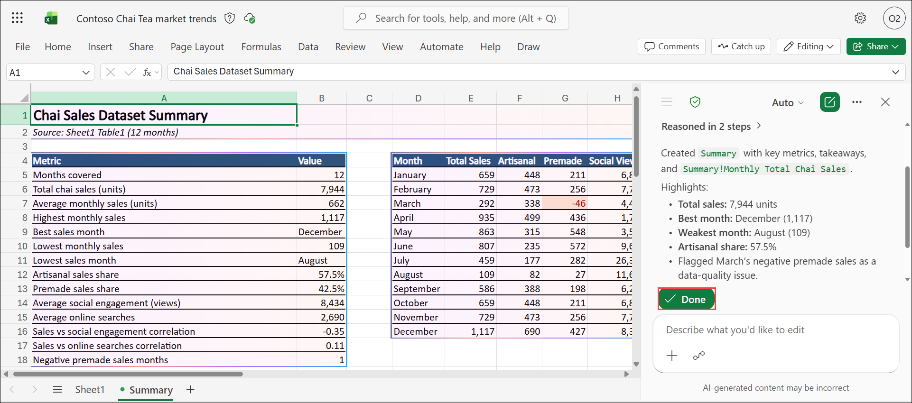

# Lab 04: Boost your productivity with data-driven decisions with Copilot in Excel

### Estimated Duration : 45 Minutes

## Lab Scenario

Imagine you're a sales manager at Contoso. Your primary responsibility is to analyse sales data and identify trends that can help improve the company's performance. In this hands-on Lab, you'll use Copilot in Excel to explore and analyse various aspects of the sales data for Contoso's Chai products. You'll start by getting an overview of the data and identifying key metrics. Next, you'll analyse sales trends, compare product sales, and calculate total sales. Additionally, you'll examine the relationship between social media engagement and chai sales, and identify any correlations between online searches and sales. Finally, you'll generate insights from your analysis and summarize the key findings.

## Lab Objectives

In this lab, you will complete the following tasks:

- Task 1: Explore the data
- Task 2: Identify sales trends
- Task 3: Compare product sales
- Task 4: Calculate total sales
- Task 5: Generate insights
- Task 6: Send your insights to the team

## Lab prerequisites

Throughout this Lab, we'll craft prompts for Microsoft 365 Copilot that reference this file. You should have already uploaded it to OneDrive during the lab setup process, but if you need to download it again, you can do so here:

1. In the Lab VM, open a web browser, right click on the following link [Contoso Chai Tea market trends 2023.xlsx](https://go.microsoft.com/fwlink/?linkid=2268822) then **Copy link** and then paste it on the browser tab to download the word file.

1. Select **Download file**.

    

1. Right click on the following link, [M365 Copilot](https://m365.cloud.microsoft/apps/?auth=2) then **Copy link** and then paste it on the browser tab to navigate to the **M365 Copilot**.

1. Provide the credentials below to login:

   - **Email/Username:** <inject key="AzureAdUserEmail"></inject>

   - **Password:** <inject key="AzureAdUserPassword"></inject>

1. In the Microsoft 365 portal, click on the **App launcher  (1)** button and select **OneDrive (2)**.   

    

1. Navigate to **My files**.

    

1. Select **Create or Upload (1)** and then select **Files upload (2)**.

    

1. Navigate to **Downloads (1)**, then select **Contoso Chai Tea market trends 2023.xlsx (2)** and then **Open (3)**.

   

1. Make sure the file uploaded.

## Task 1: Explore the data

In this task, you will use Copilot in Excel to review the dataset, generate a summary, and identify the key metrics that will guide your analysis.

1. Open the sample file (Contoso Chai Tea market trends 2023.xlsx) you uploaded to your OneDrive.

1. From the Excel workbook, select **Copilot** icon located at the bottom-right corner of the screen to open the Copilot pane.

    

    > **Note:** Use the **Edit** option to control how Copilot responds. You can choose **Allow editing** to let Copilot directly modify the document, or select **Chat only** if you prefer Copilot to provide suggestions in chat without making changes to the document.

    .png)

1. Enter the following prompt **(1)** and then select **Send (2)**:
   
    ```
    Summarize the dataset and provide an overview of the key metrics.
    ```

    

    

    > **Note:** When you ask Copilot to summarize the dataset, it may automatically create and insert a structured table (such as totals, averages, minimums, and maximums) in the worksheet, even if not explicitly requested. This behavior depends on the selected mode, if **Allow editing** is enabled, Copilot can directly add or modify content in the workbook; if **Chat only** is selected, it will provide the summary in chat without making changes to the worksheet.

    

1. Copilot responds with a detailed set of important takeaways, essentially an executive summary, of the data. It shows patterns and interpretations of the data, and recommended next steps. From this response, you can prompt Copilot to:

    ```
    Create a table showing the key patterns in the data.
    ```

    

1. Copilot creates tables containing additional columns that shows key patterns.

    

1. Review the table.

> **Congratulations** on completing the task! Now, it's time to validate it. Here are the steps:

- Hit the Validate button for the corresponding task. You will receive a success message. 
- If not, carefully read the error message and retry the step, following the instructions in the lab guide.
- If you need any assistance, please contact us at cloudlabs-support@spektrasystems.com. We are available 24/7 to help you out.

<validation step="496420d0-071c-4b60-a20e-1f6343d2e322" />

## Task 2: Identify sales trends

In this task, you will use Copilot in Excel to visualize total chai sales over time and identify key patterns and trends.

1. Continue in the opened Copilot pane.

1. Prompt Copilot with:

    ```
    Show a line chart of Total Chai Sales (units) over the months.
    ```

    

1. Review Copilot’s response, and if needed, click **+ Add to new sheet** to insert the chart into a new worksheet.

    

1. If you added the line chart, review the chart then return to Sheet 1.

    

> **Congratulations** on completing the task! Now, it's time to validate it. Here are the steps:

- Hit the Validate button for the corresponding task. You will receive a success message. 
- If not, carefully read the error message and retry the step, following the instructions in the lab guide.
- If you need any assistance, please contact us at cloudlabs-support@spektrasystems.com. We are available 24/7 to help you out.

<validation step="628501ae-768a-43b8-988d-65b5ae5c7d9f" />

## Task 3: Compare product sales

In this task, you will use Copilot in Excel to compare Artisanal and Premade Chai sales using visualizations and summaries to determine overall performance.

1. Continue in the opened Copilot pane.

1. Prompt Copilot with:

    ```
    Create a bar chart comparing Artisanal Chai Sales (units) and Premade Chai Sales (units) for each month.
    ```

    

1. Copilot displays the bar chart. Select **+ Add to new sheet**.

   

1. Once you've reviewed the bar chart results, return to Sheet 1.
   
1. Summer months can see a wide variance of sales. To understand what type of tea is selling best, you can ask Copilot to determine which product category performed better overall by entering the following prompt:

    ```
    Summarize the total sales (units) for Artisanal Chai and Premade Chai over the summer.
    ```

   

## Task 4: Calculate total sales

In this task, you will use Copilot in Excel to calculate and summarize total quarterly sales by combining Artisanal and Premade Chai sales data.

1. Continue in the opened Copilot pane.

1. Prompt Copilot with:

    ```
    Calculate the total sales per quarter.
    ```

1. Select **+ Add to new sheet**.

    

1. Review the total sales, then return to Sheet 1.

## Task 5: Generate insights

In this task, you will use Copilot in Excel to generate a summary of key insights from your analysis to support data-driven decision-making.

1. In the opened Copilot pane, enter the following prompt:

    ```
    Provide a summary of the key insights from the analysis of the Contoso Chai Tea market trends data.
    ```

    

## Task 6: Send your insights to the team

In this task, you will use Copilot in Outlook to draft and share a professional email summarizing the key insights with your stakeholders.

1. **Copy** the text response generated by Copilot in Excel by highlighting the text and selecting the **Copy response** icon below the response.

1. Open Microsoft Outlook by entering the URL <https://outlook.office.com> and select **New email**.

1. Paste the response into the email.

1. Select all the text and then click on the **Open Copilot** icon in the email window.

    

1. Enter the following prompt **(1)** and click **Generate (2)**:

    ```
    Draft an email to my team summarizing the key points from our recent analysis on Contoso Chai Tea market trends.
    ```

    

1. Review the draft provided by Copilot and select **Replace** to include the content in your email.

    

When working in your own environment, you would then send the email to your stakeholders.

> **Congratulations** on completing the task! Now, it's time to validate it. Here are the steps:

- Hit the Validate button for the corresponding task. You will receive a success message. 
- If not, carefully read the error message and retry the step, following the instructions in the lab guide.
- If you need any assistance, please contact us at cloudlabs-support@spektrasystems.com. We are available 24/7 to help you out.

<validation step="35856953-82ac-4211-b47e-b177f59ee436" />

## Summary

In this lab, you gained hands-on experience using Microsoft 365 Copilot in Excel to analyse market trends, identify patterns, and extract meaningful insights from your data. You explored how Copilot can assist in interpreting datasets, generating summaries, and visualizing key metrics to support decision-making. By experimenting with various prompts, you enhanced your ability to interact with data more efficiently and intuitively.

Continue practicing with different Excel files and prompts to deepen your understanding and maximize the value Copilot brings to your data analysis workflows.

### You have successfully completed the lab. Click **Next >>** to proceed.

