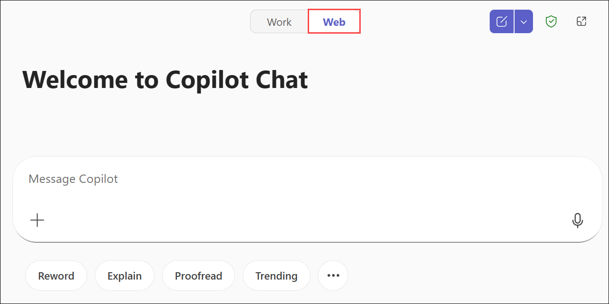
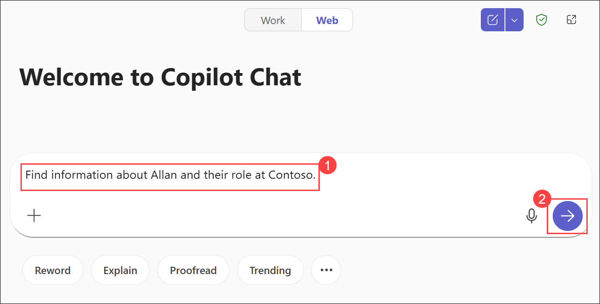

# Lab 05: Ace your interview with Copilot Chat

### Estimated Duration : 45 Minutes

## Lab Scenario

Imagine you're interviewing for position at Contoso, a mid-sized media-driven company. You've been communicating with the hiring manager via email. Now, you want to prepare for the interview, learn more about the team you'll be working with, and draft answers to potential questions that you may be asked. This Lab guides you through the steps to ensure you're well-prepared and confident.

## Lab Objectives

In this lab, you will complete the following tasks:

- Task 1: Research the interviewer
- Task 2: Research the department
- Task 3: Generate anticipated questions
- Task 4: Generate answers
- Task 5: Create an FAQ document
- Task 6: Send a thank you email using Copilot in Outlook (Optional)

## Task 1: Research the interviewer

In this task, you will use Copilot Chat in Teams to research the interviewer. You’ll gather insights about their role and responsibilities at Contoso, helping you better understand who you’ll be speaking with and prepare more effectively for the interview.

1.  Open Microsoft Teams by navigating to the following URL: [teams.microsoft.com](https://teams.microsoft.com) or through the desktop application.

1. Provide the credentials below to login:

   - **Email/Username:** <inject key="AzureAdUserEmail"></inject>

   - **Password:** <inject key="AzureAdUserPassword"></inject>

1. Select the **Copilot** Chat icon on the left side of the screen.

    

1. Make sure the toggle at the top of the screen is set to **Web**.

    

1. Prompt Copilot with:

    ```
    Find information about Allan and their role at Contoso.
    ```

    

1. Review the information provided by Copilot.

    

> **Congratulations** on completing the task! Now, it's time to validate it. Here are the steps:

- Hit the Validate button for the corresponding task. You will receive a success message. 
- If not, carefully read the error message and retry the step, following the instructions in the lab guide.
- If you need any assistance, please contact us at cloudlabs-support@spektrasystems.com. We are available 24/7 to help you out.

<validation step="83ed8ad0-c1b0-4338-b435-d05fc802dc23" />

## Task 2: Research the department

In this task, you will use Copilot Chat to research the department you’re applying to, gaining insights about the Marketing Innovations Department at Contoso to better understand its focus and functions.

1. In the same chat with Copilot, enter the following prompt:

    ```
    Provide me with an overview of Contoso. can you tell me anything about their research department?
    ```

1. Review the information provided by Copilot.

    

## Task 3: Generate anticipated questions

In this task, you will use Copilot Chat to generate a list of potential interview questions, helping you anticipate what the interviewer might ask and prepare confident responses.

1. Continue in Copilot Chat.

1. Enter the following prompt:

    ```
    Generate a list of potential questions I may be asked in the interview.
    ```

1. Review and refine the list of questions provided by Copilot.

     

## Task 4: Generate answers

In this task, you will use Copilot Chat to draft personalized answers to the anticipated interview questions, then review and refine them to align with your experiences and the department’s messaging.

1. In the same Copilot Chat, prompt Copilot to

    ```
    Draft answers for the questions in the previous response.
    ```

    Because Copilot Chat is an iterative experience, it considers the context of previous chat interactions in the same window.

    

1. Review and edit the answers provided by Copilot to ensure they align with Contoso's internal messaging and your personal experiences.

## Task 5: Create an FAQ document

In this task, you will use Copilot Chat to compile your interview questions and answers into a single FAQ Word document, review and edit it, and then save it to OneDrive for future reference.

1. In the same Copilot Chat window, prompt Copilot to 

    ```
    Create a Word .docx document with this output.
    ```

1. Copilot generates a new Word document.

    

1. Open this document to review. If prompted, log in using the same credentials you provided when you logged in to OneDrive.

    >**Note:** On the **Unable to verify link**, click **Continue anyway**.

    

1. Enable editing to verify and update the document as necessary.

    

> **Congratulations** on completing the task! Now, it's time to validate it. Here are the steps:

- Hit the Validate button for the corresponding task. You will receive a success message. 
- If not, carefully read the error message and retry the step, following the instructions in the lab guide.
- If you need any assistance, please contact us at cloudlabs-support@spektrasystems.com. We are available 24/7 to help you out.

<validation step="2fee67dc-9e33-4d09-b410-5c8f8bb92b1a" />
   
## Task 6: Send a thank you email using Copilot in Outlook (Optional) 

In this task, you will use Copilot in Outlook to draft, personalize, and send a thank you email following your interview, ensuring it’s professional and polished.

1. Open Outlook and select **New email** button to start composing your thank you note.

1. Select the Copilot icon **(1)** in the email composition window so Copilot can help draft your thank you note.

1. Enter the following prompt **(2)** and click **Send (3)** :

      ```
      I need help with drafting a thank you note for a recent interview.
      ```

      

      Copilot  generates a draft for you.

1. Review the draft and make any necessary adjustments to personalize it.

1. Add your recipients and send your email.

## Summary

In this lab, you used Microsoft 365 Copilot Chat in Teams to prepare for a job interview by researching the interviewer and department, generating potential interview questions, and drafting personalized answers. You then compiled the questions and answers into an FAQ document in Word for future reference. Optionally, you used Copilot in Outlook to draft a professional thank-you email, completing a structured and comprehensive interview preparation process.

### You have successfully completed the Hand's-on lab. 

